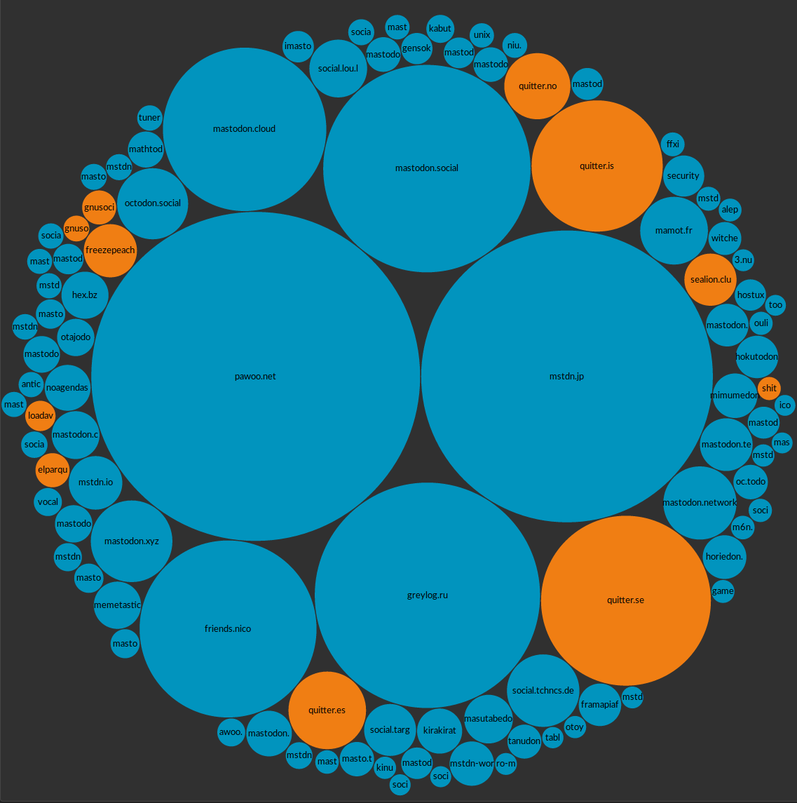

Mastodon (mastodon.social)

W3C Tech Talk
18 May 2017

Sandro Hawke

@sandhawke@mastodon.social

---

Before we get started, please watch this

(you can stop at the kid part)

<iframe width="560" height="315" src="https://www.youtube-nocookie.com/embed/vd2ct1Pljv8?rel=0" frameborder="0" allowfullscreen></iframe>

* On youtube: `https://www.youtube.com/watch?v=vd2ct1Pljv8`
What is the Mastodon Social Network?

---

Q: Will this take over the world?

---

A: Quite Possibly

- it's a crack in the dam
- showing people decentralization can work

- dunno yet if the crack is big enough

---

Q: Can the technology scale to everyone on the planet?

A: Yes, like email

- a server only handles the communiciations of the people hosted there
- hosting costs are quite reasonable
 - when mastodon.social had 43,000 users, hosting cost $0.03/user/year
 - obviously that will go up with traffic, big photos, videos

---

### W3C Standards & Mastodon

 - Mastodon built on OStatus (Atom, ActivityStreams, WebSub, Salmon, Webfinger)
 - Key folks behind OStatus went on the make ActivityPub which is W3C CR
 - Mastodon devs have started implementing ActivityPub support, especially
   for the group and private message support
 - We're asking the AC if the WG should be extended / slow down for this

---

### Run a W3C Instance?
 - discussion of W3C news/events (for people who avoid Twitter)
 - help show it's "real" and suitable for business
 - possible custom integrations (can be done by 3rd parties)
    - github events? (subscribe to commits, issues, comments)
    - meeting records? (subscribe to Proposed/Resolved)
 - name? social.w3.org or community.w3.org or mastodon.w3.org

---

### Other Questions?

- some of *my* questions on following slides

---

### Some of my favorite topics:
- bridging
- algorithmic feeds
- apps beyond microblogging
- instances (servers, admin)
- social climate

---

### Do Folks Want Bridging?
 - Inbound: use Mastodon as feed reader: rss/atom, reddit, twitter, facebook
 - Outbound: post to Mastodon and you're blogging, tweeting, etc
 - Combined: Like/Comment/Share could be bridged in+out of twitter/facebook
 - But is it necessary?   Maybe it'll have enough local content
   -  This mistake led Eric Ries to propose "Lean Startup"

---

### Algorithmic Feeds
 - I haven't heard of anything happening yet
 - Sliders: let's have a smart mixing board, that users control
 - Also set the boundaries of who you can interact with; put a safety wall
   around your social graph, if you want

---

### Application Areas (not just Twitter, thanks)
-    facebook style sharing with friends
-    chat rooms
-    photo sharing (instagram)
-    photo management (google photos)
-    video sharing (youtube)
-    ride sharing (uber, lyft)
-    individual e-commerce (ebay, craigslist)
-    matchmaking (hiring, dating)               

---

### Instance Issues
-    Commercial hosting (on your domain, for your community)
-    Commercial hosting on their domain
-    One-click install
-    Instance directory with meaningful policy details
-    Data migration
-    Follower migration
-    Migration after unexpected failure
-    Fun idea: `https://github.com/sandhawke/admin-survey`

---

### Social Climate Issues (Coming Someday)
-    Spam
-    Bots
-    Unacceptable views (Nazis, feminazi, ...)
-    Clickbait
-    Echo Chambers
-    Criminal activity (dark web)
-    Identity verification
-    Acceptable use policies
-    Veracity management (fake news)

---

### Near-Term Challenges

 - trolls
 - volunteer sysadmins
 - too-narrow vision
 - no professional staff, PR, etc
 - complex politics of search?
 - protocol shortcomings re: private messages, private groups
 - weakness of instance=community model

---

### And yet... 

---

### Stats

* `https://radar.amberstone.digital/chart/fediverse` radar (bubble chart)
* `https://metadon.jemu.name/#users` metadon (users, and a lot more)
* `https://dashboards.mnm.social/` mnm, time series dashboard

and

* <a href="https://www.w3.org/wiki/SocialCG">Active: Social Web CG (meeting tomorrow)</a>

